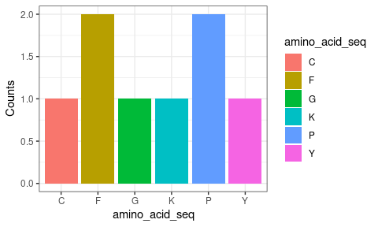

centraldogma
================

<!-- README.md is generated from README.Rmd. Please edit that file -->

# centraldogma

<!-- badges: start -->
<!-- badges: end -->

The goal of centraldogma is to …

## Installation

You can install the development version of centraldogma from
[GitHub](https://github.com/) with:

``` r
# install.packages("devtools")
devtools::install_github("rforbiodatascience22/group_7_package")
```

## Example

This is a basic example which shows you how to solve a common problem:

``` r
library(centraldogma)
## basic example code
```

What is special about using `README.Rmd` instead of just `README.md`?
You can include R chunks like so:

``` r
summary(cars)
#>      speed           dist       
#>  Min.   : 4.0   Min.   :  2.00  
#>  1st Qu.:12.0   1st Qu.: 26.00  
#>  Median :15.0   Median : 36.00  
#>  Mean   :15.4   Mean   : 42.98  
#>  3rd Qu.:19.0   3rd Qu.: 56.00  
#>  Max.   :25.0   Max.   :120.00
```

You’ll still need to render `README.Rmd` regularly, to keep `README.md`
up-to-date. `devtools::build_readme()` is handy for this. You could also
use GitHub Actions to re-render `README.Rmd` every time you push. An
example workflow can be found here:
<https://github.com/r-lib/actions/tree/v1/examples>.

You can also embed plots, for example:


In that case, don’t forget to commit and push the resulting figure
files, so they display on GitHub and CRAN.

# Week 8 Group Assignment

## Members - Anna Miotto, Dimitrios Loukas, Federica Rapelli, Paolo Federico, Siddhi Jain

Github link- <https://github.com/rforbiodatascience22/group_7_package>

# Instruction manual for centraldogma package

This package is designed for converting DNA sequences to RNA sequences,
and also to Amino acid sequence. It also allows the user to plot a
histogram of the occurrence of amino acids in the given sequence. The
output of every function can be used as input for the next one.

It is consists of 5 main functions which are briefly described below:

## Function 1 (generate_random_seq)

This function generates a random sequence of the specified length with
replacement from the nucleotides “A”,“T”,“G” and “C”

``` r
#generating a random sequence of length 10
generate_random_seq(10)
#> [1] "GTCAAGCGTT"
```

``` r
#generating a random sequence of length 50
generate_random_seq(50)
#> [1] "GGGATACAACCTCCGTGTTAGGGCAAAGGAAAGATGCATATTCGGTTAAG"
```

## Function 2 (transcription)

This function converts a DNA sequence to an RNA sequence

``` r
#This function replaces "T" with "U" to give an RNA sequence
transcription("ATTGGCCTGC")
#> [1] "AUUGGCCUGC"
```

## Function 3 (creating_codons)

This function gives the user a list of codons generated from the input
RNA string

``` r
creating_codons("AUUGGA")
#> [1] "AUU" "GGA"
#The output is supposed to be a list of codons
```

## Function 4 (translation)

This function converts the list of codons to a sequence of amino acids

``` r
#This takes a list of codons as input and converts them to amino acids
translation(c("AAG","CCU","UUU","GGG","UGC","UAC","UUU","CCU"))
#> [1] "KPFGCYFP"
```

## Function 5 (amino_acid_occurrance)

This function takes a sequence of amino acids as input and creates a
histogram of the occurrance of the respective amino acids

``` r
amino_acid_occurance("KPFGCYFP")
```



## Functions in conjunction

``` r
amino_acid_occurance(translation(creating_codons(transcription(generate_random_seq(50)))))
```

## Discussions from Task 4

1)  See above

2)  We tried adding the packages using
    usethis::use_package(“packageName”) for each package, but this gave
    us a “duplicates” error. Instead we added the packages like so:
    usethis: :use_package(“usethis”),
    use_package(“magrittr”),use_package(“ggplot2”),use_package(“tidyverse”),use_package(“tidy”)
    without repeating “usethis” more than once.

3)  We should try to limit the number of dependencies because it
    increases the computational time for loading and processing the
    package. It can not be avoided when we are using functions similar
    to the ones that already exist, and also when you are performing a
    specific task which requires exactly the functions present in an
    existing package. For example-the package “usethis” is necessary to
    loading package functions without importing them.

4)  When we use @import, we only import the package for the function we
    have written it in. And using package::function() in the DESCRIPTION
    file allows the package to be used in all the functions without
    repeated importing.

Further functions might produce a plot of the codon usage (distribution
of the codons occurence) and find the start and the stop codons to
identify coding sequences.
